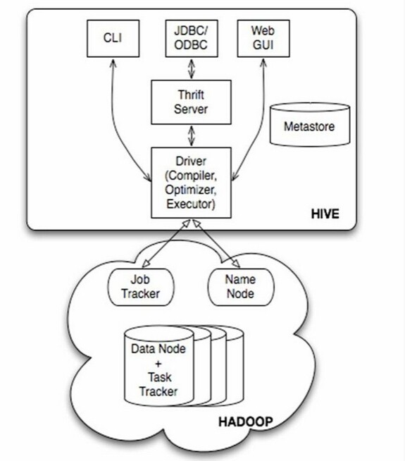

# Hive学习笔记

**特点总结**  
基于Hadoop的数据仓库工具（对分布式文件进行操作）并提供SQL语句查询；使用MapReduce实现SQL查询；静态批处理，高延迟，非实时性；

*相关学习资料*  
>[官方文档]("https://cwiki.apache.org/confluence/display/Hive/GettingStarted)  
[文档翻译](https://blog.csdn.net/strongyoung88/article/details/53743937)   *质量相当好 推荐*  
[性能调优](https://cloud.tencent.com/developer/article/1913357)  
[学习教程](http://lxw1234.com/archives/tag/learn-hive/page/2)  
---
**HIVE架构** 


---

对外接口来看，hive对外提供三个接口，完成用户交互（cli,jdbc,webGui);
内部主要由元数据（Metastore）存储Hive表格数据，由Mysql或者Derby负责存储,驱动（Driver）完成对HQL的MapReduce映射；向下，数据存储在Hadoop的文件系统中（一般指HDFS），对Hive映射来的MapReduce程序进行运行；
  
**数据单元**  
根据颗粒度划分（官方原话），划分为  
数据库database  主要完成命名空间划分还有安全功能  
数据表table  对应传统数据库的数据表  
分区partition   针对数据库进行分区，一般根据数据表中的特定列进行分区（特定列 虚拟列 实际表中并无该列 只是存储时会根据虚拟列进行存储 2*3问题）
桶或簇bucket cluster  对已经分区的数据，根据表中的某列进行哈希分割为更小的桶或者簇，

**数据格式及内置运算**   

Integers   
TINYINT 一位整型 *与二进制的关系？*  
SMALLINT 两位整型  
INT 四位整型  
BIGINT 八位整型

布尔类型  
BOOLEAN

浮点数   
FLOAT  
DOUBLE

定点数  DECIMAL(可指定范围和小数点位数)  

字符串  STRING  字符串序列
VARCHAR  可变长度（有最大长度限制的字符串序列）
CHAR 指定长度

日期与时期  
TIMESTAMP （精确到纳秒）
DATA

二进制 BINARY

**安装 配置** （对配置属性进行分析） 

**存储文件类型**
Hive支持三种存储文件类型  
 

**基本操作**  
<u>主要熟悉关键字</u> 

1. 浏览表与分区
   >SHOW TABLES; 查看所有表<br>
   >SHOW TABLES table_name; 查看特定表<br>
   >SHOW PARTITIONS table_name; 查看特定表的分区<br>
   >DESCRIBE table_name; 列出表的列和列的类型 <br>
   >DESCRIBE EXTENDED table_name (PARTITION (city = 'BJ')); 列出表的列和表的其他信息 <br>
   
2. 修改表
   >ALTER TABLE table_name RENAME TO new_table_name; 修改表名<br>
   >ALTER TABLE table_name ADD COLUMNS(c1 INT,...); 新增表格列 <br>
   
3. 删除表和分区  
   ***注意删除表和分区可能导致数据不可逆损失***
   >DROP TABLE table_name; 删除表<br>
   >ALTER TABLE table_name DROP PARTITION (city = 'BJ') 删除分区,<br>
4. 新建表
   ```SQL
   CREATE EXTERNAL TABLE page_view(viewTime INT, userid BIGINT,  
                page_url STRING, referrer_url STRING,
                ip STRING COMMENT 'IP Address of the User')
    COMMENT 'This is the page view table'
    PARTITIONED BY(dt STRING, country STRING)  #根据日期和国家进行分区
    CLUSTERED BY(userid) SORTED BY(viewTime) INTO 32 BUCKETS #对userid分为32个桶 并根据viewTime进行排序
    ROW FORMAT DELIMITED   #可指定分隔符类型
        FIELDS TERMINATED BY '1'
        COLLECTION ITEMS TERMINATED BY '2'
        MAP KEYS TERMINATED BY '3'
    STORED AS SEQUENCEFILE; #文件存储方式 二进制
   ```

**进阶操作** 调优

**HIVE内聚函数**  
   1. 关系运算
   2. 数学运算
   3. 逻辑运算
   

**常见问题**  
元数据和数据的关系
>元数据指hive运行所依赖的结构数据，例如hive基本信息（版本等）数据表与文件位置的映射；数据指存储在Hadoop文件系统中的基础数据，即数据仓库管理的数据  

内部表(Managed)和外部表(External)的区别
>内部表删除会直接删除HDFS中的文件；外部表则不会影响文件 在表格创建时，通过关键字External来标识表格类型；建表时外部表需要指定一个路径为内部文件，内部表则会自动生成；

```SQL
   create table zzjg(
               id int,
               jg_name string,
	            type string,
               level string)
               comment 'zongzhijigou'
               partitioned by (dayid string)
               ROW FORMAT DELIMITED FIELDS TERMINATED BY ','
               LINES TERMINATED BY '\n' STORED AS TEXTFILE;
