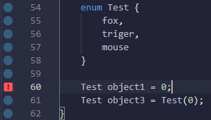

# Solidity
使用**REMIX**进行智能合约开发，使用**Solidity**作为开发语言；

## 共享协议信息
    智能合约程序编译后生成字节码并在以太坊节点上部署，为了提高智能合约的可信度，Remix建议源程序在首行添加共享协议信息。
详细的共享协议在[SPDX官网](https://spdx.dev/)可以看到；Remix官方推荐使用以下共享协议：

```javaScript
// SPDX-License-Identifier: GPL-3.0
```
---
## 变量
**值类型** 
* 布尔类型
    > 挖个坑，后面补一个关于位运算的笔记内容
* 整数类型
    >根据类型的长度和表示范围可以分为  
    >uint8~uint256  
    >int8~int256
* 枚举类型
    >枚举类型同C语言一致，枚举类型被返回的结果为uint  
    >允许显式转换，不允许隐式转换

    
* 地址类型  
    >大小为20个字节，160位；  
    >地址类型变量有一系列属性与函数  
    >balance send  transfer call
      
**引用数据类型**
* 数组类型
* mapping类型
* string类型
    >使用UTF-8编码的任意长度字符串，无尾随零
* struct类型

**常量**  
只能用于修饰国定值的值类型数据与字符串数据；  
需要在编译时确定值；

**数据位置**  
 
    在合约中声明与使用的变量需要为其指定存储位置;
    变量数据位置的设置与合约的Gas消耗有关 //挖坑 为什么与Gas消耗有关
    Solidity提供三种Data Location
* storage
    >用于存储永久数据，合约的环境变量默认存储位置为storage，可以被合约内的所有函数访问；
* memory
    >一般用于存储临时变量
* calldata
    >存储不可修改的非持久化数据，类似于memory，但只能用于函数的输入参数位置；  
    >外部函数external function的传入参数强制为calldata；  
    >在内部函数internal function中使用calldata，可以节省数据复制消耗（如果为memory类型需要拷贝），节省了Gas消耗

// 需要更多的示例来支持

---
## 函数
**一般函数定义标准**  
```
function funName(string memory str1) public view Modifier returns(unit,string) {
}
```

**函数相关参数介绍**  
* pure/view
    >pure 定义函数不会对state进行修改以及读取state状态；
    >view 定义函数不会对state进行修改
    >两者都不会消耗Gas
// 挖坑 对于禁止情况的列举
* 函数/变量可见性参数 
  
    | 参数 | Details |
    |:---:|:---|
    |external| 可以向其他合约提供函数访问服务；合约内调用需要使用this关键字；|
    |public|可以内部调用或使用message调用；一个public变量，会自动生成getter与setter函数|
    |internal| internal函数或者变量只能通过内部调用获取得到；派生合约可以调用；|
    | private | 只有本合约可以访问private函数与变量，派生合约无法调用；|

    > What is meaning?  
    >External functions are sometimes more efficient when they receive large arrays of data

**构造函数**  
可以选用带参数与不带参数的两种不同形式构造函数
```
constructor() {
        owner=msg.sender;
    }
```

**Modifier函数修改器**

    一般用于允许函数前的条件检查，一个函数可以使用多个Modifier  
    类似Spirng中的切面编程  
    可以选择带参数（一般指）或不带参数
    可继承，覆盖但不可以重载 //TODO 验证

>Modifier修改器需要在其内部尾部声明一句_; 用于表示执行被Modifier修饰的函数

**函数重载**
**数学函数**
**加密函数**

---
## 日志系统

---
## 异常处理


---
## 合约继承 or 合约派生


---


